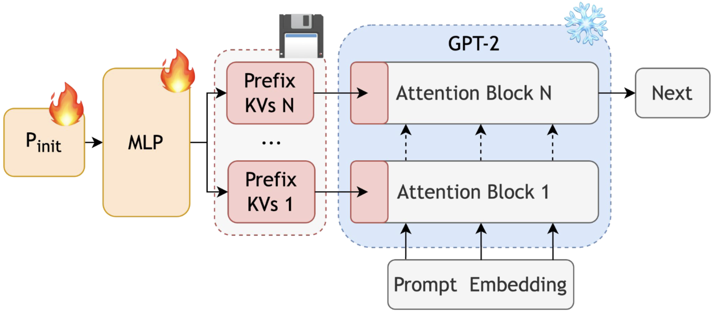
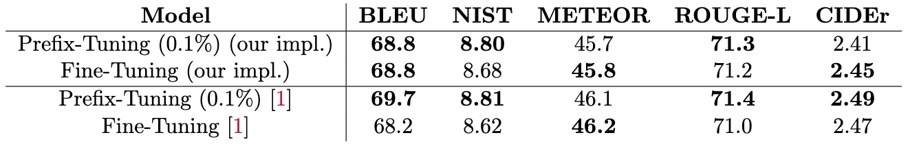
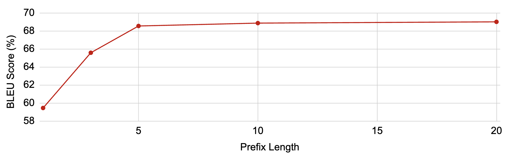

# prefix-tuning
Mac Turner, Michael Ngo, Eric Hu, Neeraj Parihar

## Introduction
This repo is a re-implementation of Prefix-Tuning: Optimizing continuous prompts for generation by Xiang Lisa Li and Percy Liang [1]. This paper introduces a finetuning method that requires only tuning only 0.1\% of the parameters for comparable if not better performance than full finetuning.

## Chosen Result
We re-implement prefix-tuning and fine-tuning for GPT-2 Medium on the E2E NLG dataset [2] and show that prefix-tuning achieve comparable performance with full fine-tuning while being faster to train and memory efficient to store. This is the upper-left quadrant of Table 1 in [1]. We also perform an ablation study on prefix length. This is Figure 4 in [1].

## Repo Structure
```bash
.
├── data
│   └── e2e_data
├── e2e-metrics # imported submodule from official eval scripts
│   └── measure_scores.py
├── environment.yaml
├── evals # stores model outputs
├── models # store models
├── poster
│   └── poster.pdf
├── report
│   └── prefix_tuning_2page_report.png
└── src
    ├── configs
    │   ├── hyperparameters.yaml # training
    │   └── prefix_tuning.yaml # initialization
    ├── data_gen.py # create small debugging datasets
    ├── data_load.py # put data into dataloaders
    ├── output_gen.py # test-time inference
    ├── prefix_tuner.py # define prefix tuning wrapper
    ├── train.py # training loop
    └── train_small.py
```
We deviate from the specified structure with the `src` folder instead of `code` and `evals` instead of `results`. Tables are produced by running the E2E evaluation script.

## Re-implementation Details
We import pretrained GPT-2 models from HuggingFace and wrap them via PyTorch. We follow the same training procedure as [1] with 5 epochs, prefix length 5, batch size 10, learning rate 8e-5 (and 5e-5 for fine tuning), linear learning schedule, and beam search with length 5. We evalute GPT-2 Small and Medium on the E2E NLG dataset using the official metrics scripts, so we have BLEU, NIST, METEOR, ROUGE-L and CIDEr. See figure below and [1] for more details.


## Setup
Install the conda environment from `environment.yaml`

To use the E2E evaluation scripts, you must have Java 1.8 or higher and Perl 5.8.8 or higher with the [XML::Twig](http://search.cpan.org/~mirod/XML-Twig-3.49/Twig.pm) CPAN module.

First, before training the model, set the hyperparameters you want to train with in `src/configs/hyperparameters.yaml` train the model. To choose between prefix-tuning and full fine-tuning, set the hyperparameter `tuner` to `"prefix"` or `"fine"`.

Then, you can train the model. (And create a models folder if there's an error about that)
```
python src/train.py
```

Then, run the model on the E2E dataset to generate an output file using
```
python src/output_gen.py
```

Finally, to run the evaluation metrics on the generated output, run
```
./e2e-metrics/measure_scores.py src/target.txt src/model-output.txt 
```

We trained on a single GPU with 16GB of VRAM.

## Results
The results are that fine-tuning and prefix-tuning are comparable, so our prefix-tuning is slightly worse than that is found by [1]. Further, as prefix-length increases, so does the BLEU score for table-to-text generation.




The original paper found fine-tuning to take about 1.5 times as long as prefix-tuning to train. This ratio was around 1.8 for us.

## Conclusion
We were able to get comparable performance with prefix-tuning to fine-tuning, and it trained faster. We learned to iterate early and often. Don't get caught up trying to figure out what's 100% right.

## References

[1]: Xiang Lisa Li and Percy Liang. Prefix-tuning. <https://aclanthology.org/2021.acl-long.353/>

[2]: Jekaterina Novikova, Ondrej Dusek, and Verena Rieser. The E2E datatset. <https://aclanthology.org/W17-5525/>

## Acknowledgement
This re-implementation was completed as a final project for [CS 4782: Introduction to Deep Learning](https://www.cs.cornell.edu/courses/cs4782/2025sp/) in Spring 2025.


